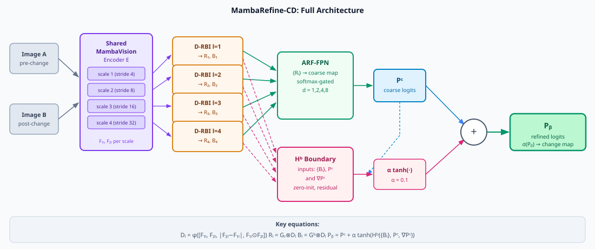

# MambaRefine-CD: Differential Region–Boundary Interaction for Remote Sensing Change Detection

A research codebase for bi-temporal remote-sensing change detection using a shared **MambaVision** encoder, **Differential Region–Boundary Interaction (D-RBI)**, and an **Adaptive Receptive Field (ARF) refinement decoder**.

---

## Links

- **Paper:** [Coming soon]
- **Project page:** [Coming soon]
- **Pretrained checkpoints:** [Coming soon]
- **Benchmark results:** [Coming soon]

---

## Related Projects

- [MambaVision](https://github.com/NVlabs/MambaVision) — the backbone used in this work
- Additional change detection / remote sensing repositories may be listed here in a future update.

---

## Network Architecture

<!-- Replace with exported high-resolution architecture figure once available -->


MambaRefine-CD consists of four main components:

1. **Shared MambaVision encoder** — a single hierarchical backbone processes both temporal images and extracts four-scale feature pyramids.
2. **D-RBI (Differential Region–Boundary Interaction)** — per-scale modules fuse the bitemporal features into structured difference representations, then decompose them into region and boundary streams via learned, bounded gates.
3. **Adaptive RF decoder (ARF-FPN)** — aggregates region-stream features across scales using softmax-gated dilation rates, producing a coarse change prediction `P_c`.
4. **Boundary residual refinement** — a lightweight boundary head takes the boundary stream features and `P_c` as context, and adds a bounded residual correction to produce the final refined prediction `P_f`.

---

## Results

> Results will be updated once training on each benchmark is complete. Placeholder tables are provided below.

<!-- Replace with final qualitative figure -->


### LEVIR-CD

| Model | mF1 | F1_1 | mIoU | IoU_1 | OA | Boundary F1 |
|---|---|---|---|---|---|---|
| Baseline | TBD | TBD | TBD | TBD | TBD | TBD |
| Adaptive RF | TBD | TBD | TBD | TBD | TBD | TBD |
| **MambaRefine-CD** | **TBD** | **TBD** | **TBD** | **TBD** | **TBD** | **TBD** |

### WHU-CD

| Model | mF1 | F1_1 | mIoU | IoU_1 | OA | Boundary F1 |
|---|---|---|---|---|---|---|
| Baseline | TBD | TBD | TBD | TBD | TBD | TBD |
| Adaptive RF | TBD | TBD | TBD | TBD | TBD | TBD |
| **MambaRefine-CD** | **TBD** | **TBD** | **TBD** | **TBD** | **TBD** | **TBD** |

### DSIFN-CD

| Model | mF1 | F1_1 | mIoU | IoU_1 | OA | Boundary F1 |
|---|---|---|---|---|---|---|
| Baseline | TBD | TBD | TBD | TBD | TBD | TBD |
| Adaptive RF | TBD | TBD | TBD | TBD | TBD | TBD |
| **MambaRefine-CD** | **TBD** | **TBD** | **TBD** | **TBD** | **TBD** | **TBD** |

### SECOND

| Model | mF1 | F1_1 | mIoU | IoU_1 | OA | Boundary F1 |
|---|---|---|---|---|---|---|
| Binary baseline | TBD | TBD | TBD | TBD | TBD | TBD |
| **MambaRefine-CD (binary mode)** | **TBD** | **TBD** | **TBD** | **TBD** | **TBD** | **TBD** |

> We report both **literature-style metrics** (mF1, mIoU, OA) and **change-focused metrics** (F1_1, IoU_1, Boundary F1) for a more complete evaluation. Note that mF1 averages over the easy no-change class and can overstate model quality; F1_1 and Boundary F1 are more discriminating.

For SECOND, true **SeK** remains an evaluation metric for semantic change detection. During binary SECOND training, the objective uses a **differentiable soft-kappa / SeK-inspired surrogate loss** instead. This improves change-sensitive supervision without pretending that binary logits are semantic SeK predictions. In binary mode, report OA, Fscd, binary mIoU, and optionally binary kappa. Report true SeK only when semantic predictions exist.

---

## Usage

### Requirements

- Python 3.10+
- PyTorch >= 2.0
- torchvision >= 0.15
- timm >= 0.9
- mamba-ssm >= 1.0
- causal-conv1d >= 1.0
- albumentations, einops, scipy, tensorboard

See `requirements.txt` for the full list.

### Environment setup

```bash
conda activate mamba_new
pip install -r requirements.txt
```

### Installation

```bash
git clone <repo_url_placeholder>
cd MambaRefine-CD
```

---

## Quick Start

All settings are controlled from a single configuration file:

```
configs/global_config.yaml
```

Training outputs (checkpoints, logs, validation samples, TensorBoard events) are saved under:

```
outputs/<run_name>/
```

**Train:**

```bash
python scripts/train.py
```

**Evaluate on test split:**

```bash
python scripts/evaluate.py
```

**Benchmark all configured datasets:**

```bash
python scripts/benchmark_all.py
```

---

## Model Overview

### Motivation

In bitemporal change detection, the naive approach forms a per-pixel absolute difference:

```
D_naive = |F2 - F1|
```

This suffers from three well-known problems: it cannot distinguish real change from illumination or seasonal shift; it blurs boundary signals in smooth interior regions; and standard FPN decoders apply a fixed receptive field that cannot simultaneously capture small objects and large areas.

MambaRefine-CD addresses all three with a structured, learnable alternative.

### D-RBI formulation

For scale `l`, the D-RBI module computes:

```
Z_l  = concat(F1_l, F2_l, |F2_l - F1_l|, F1_l * F2_l)
D_l  = phi_l(Z_l)                         # learned bottleneck compression

G_r  = g_min_r + (g_max_r - g_min_r) * sigmoid(clamp(psi_r(D_l), -8, 8))
G_b  = g_min_b + (g_max_b - g_min_b) * sigmoid(psi_b(clamp(Sobel(D_l), 0, 10)))

R_l  = G_r * D_l                          # region stream
B_l  = G_b * D_l                          # boundary stream
```

- `G_r` is conditioned on interior feature magnitude; its output is bounded to `[0.2, 0.8]` to prevent any spatial location from being fully suppressed.
- `G_b` is conditioned on the Sobel edge magnitude of `D_l`; it activates most strongly at change boundaries.
- GroupNorm is applied to `F1_l` and `F2_l` before concatenation for numerical stability under fp16 AMP.

### Decoder formulation

```
P_c = H_c({R_l})                           # ARF-FPN coarse prediction (softmax-gated dilations)
P_f = P_c + 0.05 * tanh(H_b({B_l}, P_c, Grad(P_c)))   # boundary residual refinement
Y   = sigmoid(P_f)                         # final change probability map
```

- ARF-FPN uses dilation rates `d = {1, 2, 4, 8}` with per-location softmax weighting; small objects use tight context, large areas use wide context.
- The boundary head `H_b` is initialized with a zero-weight final convolution so that `P_f = P_c` at the start of training, providing a stable curriculum.
- The `tanh` bounds the residual correction; the small residual scale prevents the boundary head from overwriting the coarse prediction in early epochs.

### Why MambaVision?

- Efficient hierarchical backbone with four feature scales at strides 4, 8, 16, 32.
- Selective state-space operations (Mamba SSM) provide long-range context without quadratic attention cost.
- Deep stages encode semantic region evidence; shallow stages preserve high-frequency boundary signal — exactly the structure D-RBI exploits.
- Shared-weight design means no doubling of parameters for the two input images.

---

## Training

All training is iteration-based. Validation runs every `training.validate_every` iterations and the best checkpoint is saved automatically. Training can be resumed from any checkpoint.

### SECOND soft-kappa training note

When `loss.type: dice_focal_sek` is enabled for SECOND, training optimizes:

```text
Dice + Focal + SeK-inspired soft-kappa surrogate
```

Recommended starting weights:

```yaml
loss:
  type: dice_focal_sek
  dice_weight: 1.0
  focal_weight: 0.2
  sek_weight: 0.05
  sek_mode: binary
  sek_separate_nochange: true
```

This is a training surrogate only. It is not the same as the final semantic SeK metric used in evaluation.

### LEVIR-CD

Edit `configs/global_config.yaml`:

```yaml
dataset:
  name: LEVIR-CD
  root: /path/to/LEVIR-CD
```

Then run:

```bash
python scripts/train.py
```

### WHU-CD

```yaml
dataset:
  name: WHU-CD
  root: /path/to/WHU-CD
```

```bash
python scripts/train.py
```

### DSIFN-CD

```yaml
dataset:
  name: DSIFN-CD
  root: /path/to/DSIFN-CD
```

```bash
python scripts/train.py
```

### SECOND binary mode

SECOND is a semantic change detection dataset, but the current runtime supports it first in binary mode by converting semantic labels to change/no-change masks.

Edit `configs/global_config.yaml`:

```yaml
dataset:
  name: SECOND
  root: /storage2/ChangeDetection/MV/Datasets/SECOND
  task_type: semantic_change
  mode: binary

model:
  output_mode: binary
```

Then run:

```bash
python scripts/train.py
```

### Resume training

```yaml
resume:
  enabled: true
  checkpoint_path: outputs/run_xxx/checkpoints/best.pth
```

---

## Evaluation

### Evaluate on LEVIR-CD

Set dataset and checkpoint in `configs/global_config.yaml`, then:

```bash
python scripts/evaluate.py
```

Options in the config:

```yaml
evaluation:
  split: test
  threshold: 0.5
  threshold_sweep: true         # sweep over multiple thresholds and pick best
  threshold_select_metric: F1_1
  use_tta: false                # enable test-time augmentation if needed
```

### WHU-CD / DSIFN-CD / SECOND

Same procedure — update `dataset.name`, `dataset.root`, and the checkpoint path.

For SECOND binary mode, keep:

```yaml
dataset:
  name: SECOND
  mode: binary

model:
  output_mode: binary
```

For SECOND semantic-label evaluation with the current binary model, use:

```yaml
dataset:
  name: SECOND
  mode: semantic

model:
  output_mode: binary

evaluation:
  second_metrics: true
  compute_SeK: true
  sek_binary_fallback: false
  threshold_select_metric: Fscd
```

This writes the standard `eval_metrics.json` / `eval_metrics.csv` pair plus:

```text
outputs/eval_<timestamp>_<run_label>/second_metrics.json
outputs/eval_<timestamp>_<run_label>/second_metrics.csv
outputs/eval_<timestamp>_<run_label>/best_thresholds_SECOND.json
```

`second_metrics.json` reports `OA`, `Fscd` / `F1scd`, `mIoU`, `SeK`, `binary_F1`, `binary_IoU`, and `semantic_mIoU`.
When the model only emits binary logits, `SeK` and `semantic_mIoU` stay unavailable and the file includes a note explaining that fallback.

### Benchmark all datasets

```bash
python scripts/benchmark_all.py
```

Outputs:

```
outputs/benchmark_results.csv
outputs/benchmark_results.md
outputs/benchmark_results_latex.tex
outputs/benchmark_summary.json
```

---

## Dataset Preparation

MambaRefine-CD expects datasets in the following directory structure:

```
dataset_root/
├── train/
│   ├── A/         # pre-change images
│   ├── B/         # post-change images
│   └── label/     # binary change masks (0 = no change, 255 = change)
├── val/
│   ├── A/
│   ├── B/
│   └── label/
└── test/
    ├── A/
    ├── B/
    └── label/
```

The dataset loader supports flexible directory naming via `image_a_dir_candidates` and `image_b_dir_candidates` in the config.

### LEVIR-CD

- Primary benchmark for building change detection in high-resolution aerial imagery.
- 637 image pairs at 1024×1024 px (0.5 m/px GSD).
- Training uses a tile-based pipeline with stride-128 overlapping crops; evaluation uses non-overlapping 256×256 tiles.
- Official split: 448 train / 64 val / 128 test pairs.

### WHU-CD

- Dense urban building change detection from airborne imagery.
- Single large image pair (32207×15354 px, 0.2 m/px) covering 20.5 km².
- Tiled into 256×256 patches for training and evaluation.
- Boundary-sensitive benchmark: annotates fine-grained building footprints.

### DSIFN-CD

- Multi-scene dataset covering six Chinese cities.
- 3940 image pairs at 512×512 px across urban, road, and vegetation change types.
- Useful for generalization evaluation across heterogeneous scenes.

### SECOND

- Semantic change detection benchmark with bi-temporal semantic labels.
- Can be used immediately in binary mode by converting semantic labels into change/no-change masks.
- Future semantic mode infrastructure is included, but full semantic model outputs are not implemented yet.

**Notes:**
- Training always uses the tile-based pipeline; evaluation keeps the official val/test structure.
- Tile cache files are saved to `outputs/dataset_indices/` and reused across runs.
- A dataset leakage check is run at startup to confirm val/test tiles do not overlap with training tiles.
- Set `include_empty_ratio` in the config to control how many no-change tiles are sampled during training.

---

## Configuration Reference

All runtime settings are controlled by `configs/global_config.yaml`. For dataset switching and multiple LEVIR variants, see `configs/CONFIG_SWITCHING_GUIDE.md`. Key options:

**Hardware:**
```yaml
hardware:
  gpu_ids: [0]        # GPU to use
  mixed_precision: true
```

**Model variant:**
```yaml
model:
  variant: tiny2      # tiny | tiny2 | small | base | large
  decoder: adaptive_rf
```

**Dataset:**
```yaml
dataset:
  name: LEVIR-CD
  root: /path/to/dataset
  mode: binary
```

**Enable/disable D-RBI:**
```yaml
difference:
  enabled: true
  use_region_gate: true
  use_boundary_gate: true
```

**Training schedule:**
```yaml
training:
  batch_size: 8
  max_iterations: 50000
  lr: 5e-5
  validate_every: 5000
  gradient_clip: 0.5
```

**Resume:**
```yaml
resume:
  enabled: true
  checkpoint_path: outputs/run_xxx/checkpoints/best.pth
```

---

## Output Structure

Each training run creates a timestamped directory:

```
outputs/run_<date>_<time>_<name>/
├── config.yaml                 # full config snapshot
├── logs/
│   ├── train.log
│   └── nan_debug.csv           # NaN diagnostic log (if any)
├── tensorboard/                # TensorBoard event files
├── checkpoints/
│   └── best.pth                # best checkpoint by validation metric
├── validation/
│   └── val_metrics.csv         # per-iteration validation history
└── test_results/
    ├── test_metrics.json
    └── samples/predictions.png
```

---

## Evaluation Metrics

MambaRefine-CD reports three families of metrics:

**Literature-style (averaged over both classes):**
- `mF1` — mean F1 score over change and no-change classes
- `mIoU` — mean IoU over both classes
- `OA` — overall pixel accuracy

**Change-focused (change class only):**
- `F1_1` — F1 of the change class; more discriminating than mF1
- `IoU_1` — IoU of the change class
- `Precision_1`, `Recall_1` — precision and recall for the change class

**Boundary-focused:**
- `Boundary F1` — F1 evaluated at change boundaries
- `Edge IoU` — IoU restricted to a narrow band around annotation edges

> mF1 is commonly reported in the change detection literature but can overstate performance because the no-change class dominates (typically > 90% of pixels). We report both mF1 and change-class / boundary metrics for a more complete comparison.

---

## Project Structure

```
MambaRefine-CD/
├── configs/
│   ├── global_config.yaml          # single runtime config template
│   └── CONFIG_SWITCHING_GUIDE.md   # how to switch LEVIR / WHU / DSIFN cleanly
├── scripts/
│   ├── train.py                    # training entry point
│   ├── evaluate.py                 # evaluation entry point
│   ├── benchmark_all.py            # multi-dataset benchmarking
│   ├── validate.py                 # standalone validation
│   └── model_efficiency.py         # FLOPs / params profiling
├── src/
│   ├── models/
│   │   ├── backbone/               # MambaVision encoder wrapper
│   │   ├── modules/
│   │   │   └── differential_region_boundary.py   # D-RBI module
│   │   ├── decoders/
│   │   │   ├── adaptive_rf_decoder.py             # ARF-FPN + boundary head
│   │   │   └── baseline_decoder.py
│   │   └── cd_model.py             # full model assembly
│   ├── training/
│   │   ├── config.py
│   │   ├── metrics.py              # StreamingMetrics, boundary metrics
│   │   ├── checkpoint.py
│   │   └── logger.py
│   ├── data/                       # dataset loaders
│   └── utils/                      # visualization helpers
├── website/                        # GitHub Pages project website
│   ├── index.html
│   ├── styles.css
│   ├── script.js
│   └── assets/
│       └── diagrams/               # SVG architecture diagrams
├── outputs/                        # training runs (git-ignored)
├── requirements.txt
└── README.md
```

---

## Project Website

A standalone research website is located in `website/` and can be deployed via GitHub Pages (Settings → Pages → source: `main`, folder: `/website`).

To preview locally:

```bash
cd website
python -m http.server 8000
# Open http://localhost:8000
```

---

## License

Code is released for research purposes. See `LICENSE` for details. (Update this section with the finalized license before public release.)

---

## Citation

If you find this work useful, please cite:

```bibtex
@article{mambarefinecd2026,
  title     = {MambaRefine-CD: Differential Region--Boundary Interaction with Adaptive Receptive Field Refinement for Remote Sensing Change Detection},
  author    = {Author list to be added},
  journal   = {To be added},
  year      = {2026}
}
```

---

## Acknowledgements

We thank the developers of [MambaVision](https://github.com/NVlabs/MambaVision), [timm](https://github.com/huggingface/pytorch-image-models), and [mamba-ssm](https://github.com/state-spaces/mamba) for their open-source contributions, which this work builds upon.
