# MambaRefine-CD Model Blocks: Mermaid Flowcharts and LaTeX Equations

This document follows the current implementation in `src/models`.

Source grounding:
- MambaVision: <https://arxiv.org/abs/2407.08083>
- Mamba selective SSM: <https://arxiv.org/abs/2312.00752>
- Feature Pyramid Network: <https://arxiv.org/abs/1612.03144>
- Sobel operator reference: <https://homepages.inf.ed.ac.uk/rbf/HIPR2/sobel.htm>
- OpenCV gradient/Sobel implementation reference: <https://docs.opencv.org/master/d5/d0f/tutorial_py_gradients.html>

Implementation note: the current `src/models` code uses `TemporalDifference` modes (`abs_only`, `signed_only`, `abs_signed`) before D-RBI. It does not concatenate raw paired features `[F_a, F_b]` inside D-RBI, and it does not contain CRAM-lite in the active model path.

Provenance note: no exact arXiv/source paper was found for the names `D-RBI`, `Differential Region-Boundary Interaction`, `ARF-FPN` as implemented here, or `BoundaryRefinement` as implemented here. Those blocks are therefore documented from code, while the encoder, selective scan basis, FPN-style top-down fusion, and Sobel operator are grounded in external sources.

## 0. End-to-End Model Wiring

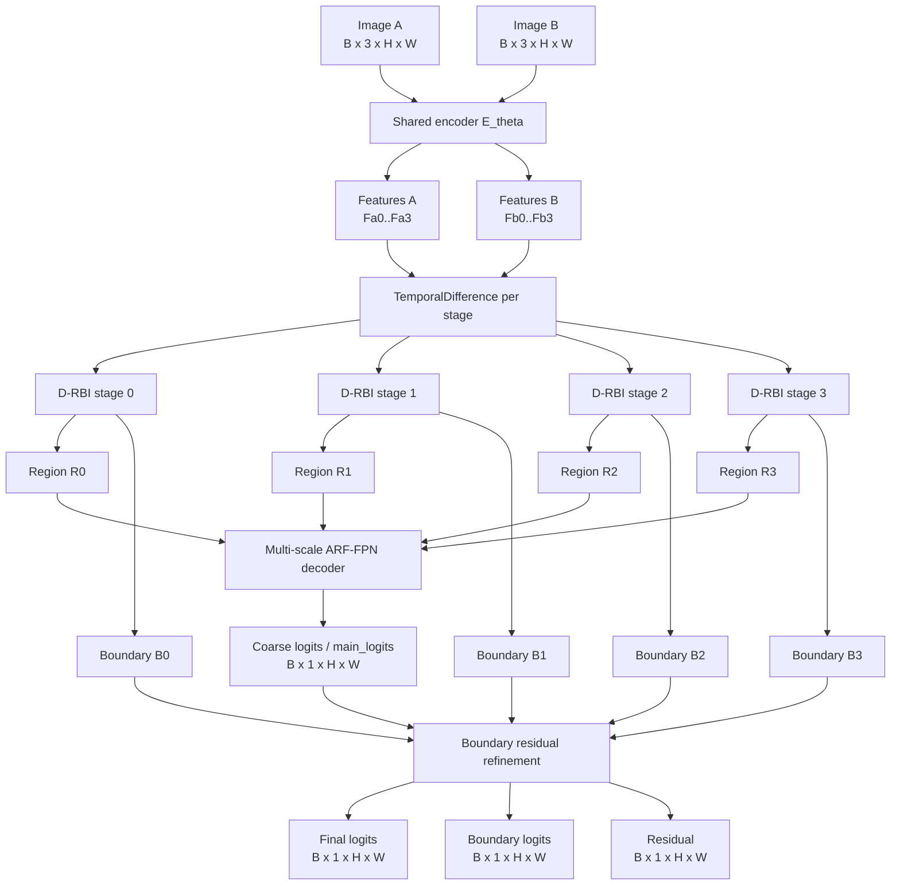

```latex
\begin{aligned}
\{F_a^s\}_{s=0}^{3} &= E_\theta(I_a),\\
\{F_b^s\}_{s=0}^{3} &= E_\theta(I_b),\\
D_{\mathrm{in}}^s &= \operatorname{TemporalDifference}(F_a^s,F_b^s),\\
(R^s,B^s) &= \operatorname{DRBI}_s(D_{\mathrm{in}}^s),\\
P_c &= \operatorname{ARFFPN}(\{R^s\}_{s=0}^{3}),\\
(P_f,P_b,\Delta P) &= \operatorname{BoundaryRefine}(P_c,\{B^s\}_{s=0}^{3}).
\end{aligned}
```

## 1. Shared MambaVision Encoder: Four Stages

Default active config is `mambavision/small`: channels `[96, 192, 384, 768]`, depths `[3, 3, 7, 5]`, heads `[2, 4, 8, 16]`, windows `[8, 8, 14, 7]`.

```mermaid
flowchart LR
  I["Input image<br/>B x 3 x H x W"] --> PE["PatchEmbed<br/>3x3 s2 Conv-BN-ReLU<br/>3x3 s2 Conv-BN-ReLU<br/>B x C0 x H/4 x W/4"]

  PE --> S0B

  subgraph S0["Stage 0 / levels.0"]
    S0B["ConvBlock x d0<br/>default small: d0=3<br/>C0=96"] --> F0["Output F0<br/>B x C0 x H/4 x W/4"]
    F0 --> DS0["Downsample<br/>3x3 s2 Conv<br/>C0 -> C1"]
  end

  DS0 --> S1B

  subgraph S1["Stage 1 / levels.1"]
    S1B["ConvBlock x d1<br/>default small: d1=3<br/>C1=192"] --> F1["Output F1<br/>B x C1 x H/8 x W/8"]
    F1 --> DS1["Downsample<br/>3x3 s2 Conv<br/>C1 -> C2"]
  end

  DS1 --> WP2

  subgraph S2["Stage 2 / levels.2"]
    WP2["Window partition<br/>window w2=14"] --> M2["MambaVision Block x ceil(d2/2)<br/>default small: 4 blocks"]
    M2 --> A2["Attention Block x floor(d2/2)<br/>default small: 3 blocks"]
    A2 --> WR2["Window reverse"]
    WR2 --> F2["Output F2<br/>B x C2 x H/16 x W/16"]
    F2 --> DS2["Downsample<br/>3x3 s2 Conv<br/>C2 -> C3"]
  end

  DS2 --> WP3

  subgraph S3["Stage 3 / levels.3"]
    WP3["Window partition<br/>window w3=7"] --> M3["MambaVision Block x ceil(d3/2)<br/>default small: 3 blocks"]
    M3 --> A3["Attention Block x floor(d3/2)<br/>default small: 2 blocks"]
    A3 --> WR3["Window reverse"]
    WR3 --> F3["Output F3<br/>B x C3 x H/32 x W/32"]
  end

  F0 --> OUT["Encoder returns<br/>{F0,F1,F2,F3}"]
  F1 --> OUT
  F2 --> OUT
  F3 --> OUT
```

```latex
\begin{aligned}
X_0 &= \rho\!\left(\operatorname{BN}\!\left(W_{2}^{3\times3,s=2}
      * \rho\!\left(\operatorname{BN}\!\left(W_{1}^{3\times3,s=2} * I\right)\right)\right)\right),\\
F^s &\in \mathbb{R}^{B \times C_s \times H_s \times W_s},\\
(H_s,W_s) &= (H/2^{s+2}, W/2^{s+2}), \qquad s\in\{0,1,2,3\}.
\end{aligned}
```

```latex
\begin{aligned}
\operatorname{ConvBlock}(X)
&= X + \operatorname{DropPath}\left(\gamma \odot
   \operatorname{BN}\left(W_2^{3\times3} *
   \operatorname{GELU}\left(\operatorname{BN}(W_1^{3\times3} * X)\right)\right)\right).
\end{aligned}
```

```latex
\begin{aligned}
X' &= X + \operatorname{DropPath}\left(\gamma_1 \odot
      \operatorname{Mixer}(\operatorname{LN}(X))\right),\\
X_{\mathrm{out}} &= X' + \operatorname{DropPath}\left(\gamma_2 \odot
      \operatorname{MLP}(\operatorname{LN}(X'))\right).
\end{aligned}
```

```latex
\begin{aligned}
X_{\mathrm{win}} &= \operatorname{WindowPartition}(X,w)
  \in \mathbb{R}^{B_w \times w^2 \times C},\\
X &= \operatorname{WindowReverse}(X_{\mathrm{win}},w,H,W).
\end{aligned}
```

### 1.1 MambaVision Mixer Equations

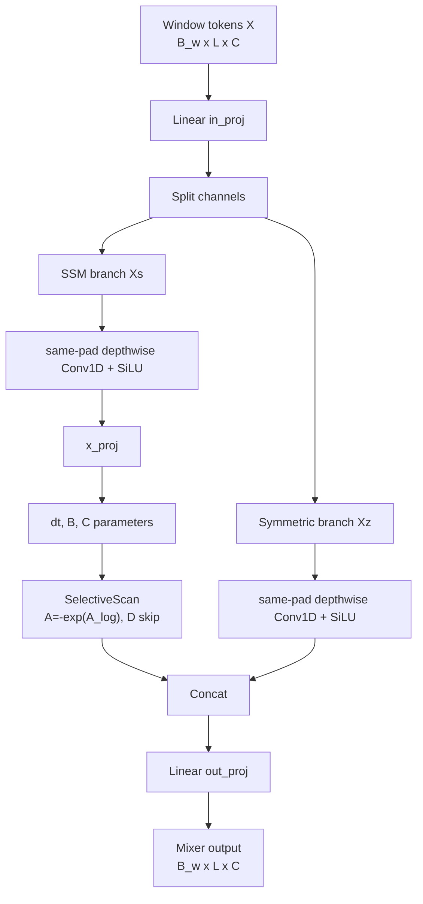

```latex
\begin{aligned}
[X_s,X_z] &= \operatorname{split}\left(W_{\mathrm{in}}X\right),\\
U_s &= \operatorname{SiLU}\left(\operatorname{Conv1D}_{\mathrm{same}}(X_s)\right),\\
U_z &= \operatorname{SiLU}\left(\operatorname{Conv1D}_{\mathrm{same}}(X_z)\right),\\
[\Delta_k,B_k,C_k] &= W_x U_{s,k},\\
A &= -\exp(A_{\log}),\\
Y_s &= \operatorname{SelectiveScan}(U_s;\Delta,A,B,C,D),\\
\operatorname{MambaVisionMixer}(X) &= W_{\mathrm{out}}\,[Y_s;U_z].
\end{aligned}
```

```latex
\begin{aligned}
h_k &= \bar{A}_k h_{k-1} + \bar{B}_k u_k,\\
y_k &= C_k h_k + D u_k,\\
\bar{A}_k &= \exp(\Delta_k A).
\end{aligned}
```

### 1.2 Attention Block Equations

```latex
\begin{aligned}
Q &= XW_Q,\qquad K=XW_K,\qquad V=XW_V,\\
\operatorname{Attention}(X)
&= W_O\left(\operatorname{softmax}\left(\frac{QK^\top}{\sqrt{d_h}}\right)V\right).
\end{aligned}
```

### 1.3 Variant Depth/Channel Summary From Code

```latex
\begin{array}{c|c|c|c}
\text{Variant} & (C_0,C_1,C_2,C_3) & (d_0,d_1,d_2,d_3) & \text{Stage 2/3 mixer split}\\
\hline
\text{T} & (80,160,320,640) & (1,3,8,4) & (4M+4A,\;2M+2A)\\
\text{T2} & (80,160,320,640) & (1,3,11,4) & (6M+5A,\;2M+2A)\\
\text{S} & (96,192,384,768) & (3,3,7,5) & (4M+3A,\;3M+2A)\\
\text{B} & (128,256,512,1024) & (3,3,10,5) & (5M+5A,\;3M+2A)\\
\text{L} & (196,392,784,1568) & (3,3,10,5) & (5M+5A,\;3M+2A)
\end{array}
```

## 2. D-RBI Block

### 2.1 Feature Difference/Concat and 1x1 Projection

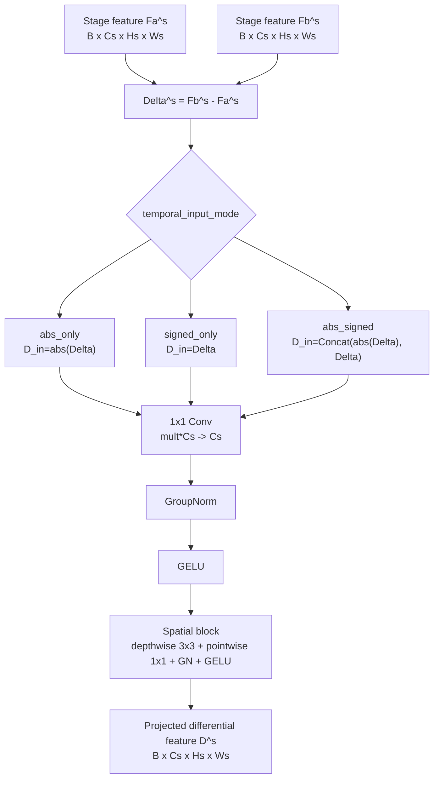

```latex
\begin{aligned}
\Delta^s &= F_b^s - F_a^s,\\
D_{\mathrm{in}}^s &=
\begin{cases}
|\Delta^s|, & \texttt{abs\_only},\\
\Delta^s, & \texttt{signed\_only},\\
[|\Delta^s|;\Delta^s], & \texttt{abs\_signed},
\end{cases}\\
\hat{D}^s &= \operatorname{GELU}\left(\operatorname{GN}\left(W_{p}^{1\times1} * D_{\mathrm{in}}^s\right)\right),\\
D^s &= \operatorname{GELU}\left(\operatorname{GN}\left(W_{\mathrm{pw}}^{1\times1} *
      (W_{\mathrm{dw}}^{3\times3} * \hat{D}^s)\right)\right).
\end{aligned}
```

### 2.2 Regional Feature Path

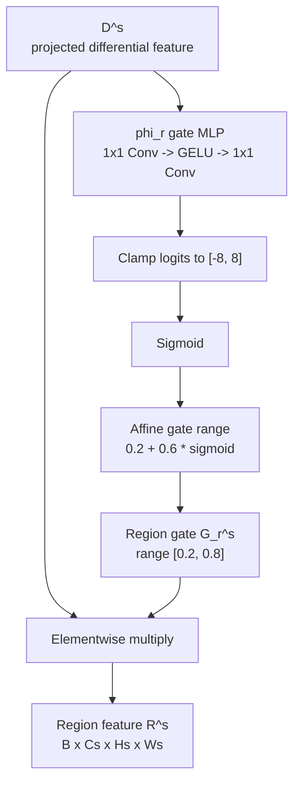

```latex
\begin{aligned}
\phi_r(D^s) &= W_{r,2}^{1\times1} *
              \operatorname{GELU}(W_{r,1}^{1\times1} * D^s + b_{r,1}) + b_{r,2},\\
G_r^s &= 0.2 + 0.6\cdot \sigma\left(\operatorname{clip}(\phi_r(D^s),-8,8)\right),\\
R^s &= D^s \odot G_r^s.
\end{aligned}
```

### 2.3 Boundary Feature Path

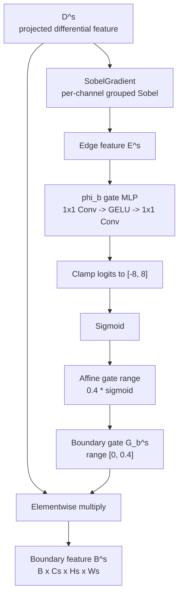

```latex
\begin{aligned}
E^s &= \operatorname{SobelGradient}(D^s),\\
\phi_b(E^s) &= W_{b,2}^{1\times1} *
              \operatorname{GELU}(W_{b,1}^{1\times1} * E^s + b_{b,1}) + b_{b,2},\\
G_b^s &= 0.4\cdot \sigma\left(\operatorname{clip}(\phi_b(E^s),-8,8)\right),\\
B^s &= D^s \odot G_b^s.
\end{aligned}
```

### 2.4 Sobel Block

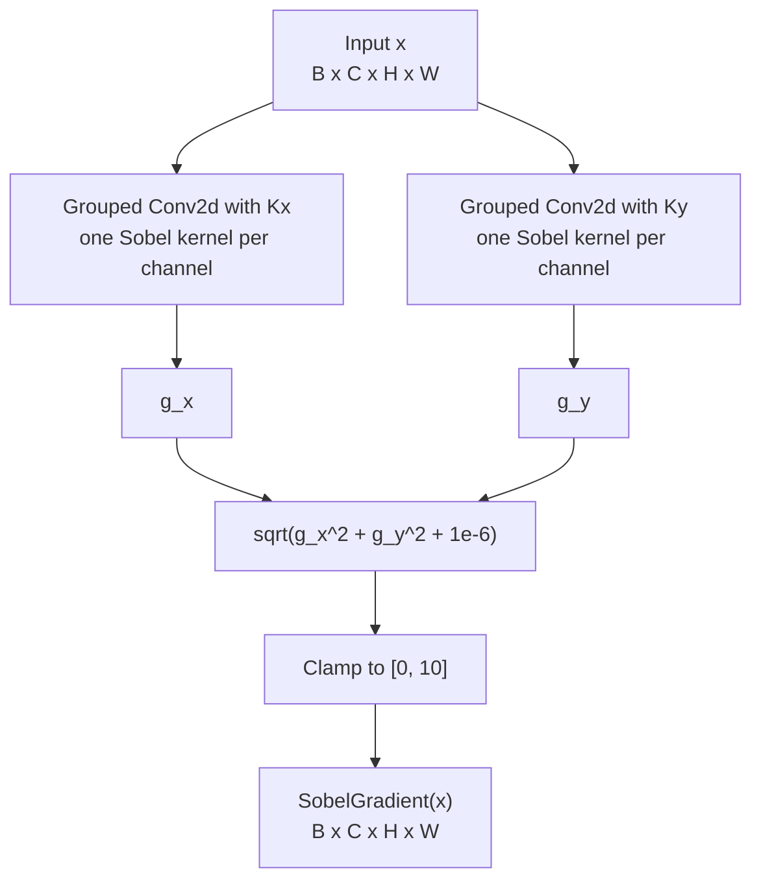

```latex
\begin{aligned}
K_x &=
\begin{bmatrix}
-1&0&1\\
-2&0&2\\
-1&0&1
\end{bmatrix},
\qquad
K_y =
\begin{bmatrix}
-1&-2&-1\\
0&0&0\\
1&2&1
\end{bmatrix},\\
G_x &= x * K_x,\qquad G_y = x * K_y,\\
\operatorname{SobelGradient}(x)
&= \operatorname{clip}\left(\sqrt{G_x^2+G_y^2+10^{-6}},0,10\right).
\end{aligned}
```

### 2.5 Phi Gate Block (`phi_r` / `phi_b`)

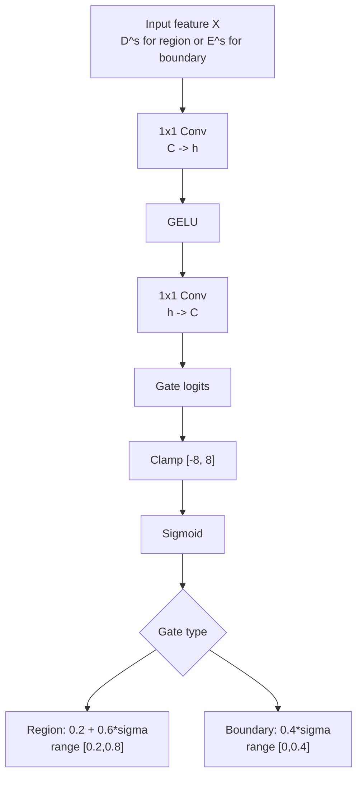

```latex
\begin{aligned}
h &= \max(\lfloor 0.25C\rfloor,1),\\
\phi(X) &= W_2^{1\times1} * \operatorname{GELU}(W_1^{1\times1} * X + b_1) + b_2,\\
\tilde{\phi}(X) &= \operatorname{clip}(\phi(X),-8,8),\\
G_r(X) &= 0.2 + 0.6\sigma(\tilde{\phi}(X)),\\
G_b(X) &= 0.4\sigma(\tilde{\phi}(X)).
\end{aligned}
```

## 3. Multi-Scale ARF-FPN Decoder

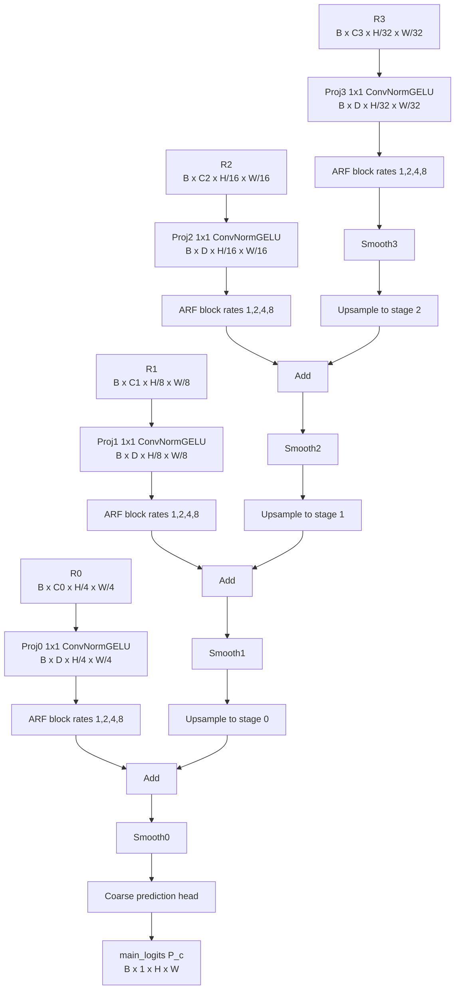

```latex
\begin{aligned}
\tilde{R}^s &= \operatorname{Proj}_{s}^{1\times1}(R^s),\\
Z_{s,r} &= \operatorname{ConvNormGELU}_{3\times3,d=r}(\tilde{R}^s),\qquad r\in\{1,2,4,8\},\\
\alpha_s &= \operatorname{softmax}\left(W_2\operatorname{ReLU}(W_1\operatorname{GAP}(\tilde{R}^s))\right),\\
P^s &= \sum_{r\in\{1,2,4,8\}}\alpha_{s,r}Z_{s,r}.
\end{aligned}
```

```latex
\begin{aligned}
T^3 &= \operatorname{Smooth}_3(P^3),\\
T^s &= \operatorname{Smooth}_s\left(P^s +
      \operatorname{Up}(T^{s+1};H_s,W_s)\right),\qquad s=2,1,0,\\
P_c &= \operatorname{Up}\left(\operatorname{Head}(T^0);H,W\right).
\end{aligned}
```

## 4. Coarse Prediction Head

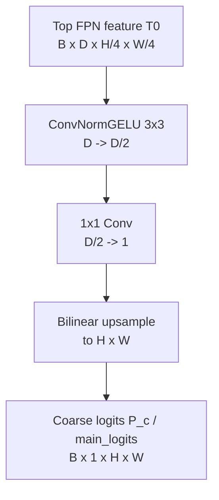

```latex
\begin{aligned}
H_c &= \operatorname{GELU}\left(\operatorname{GN}\left(W_h^{3\times3} * T^0\right)\right),\\
\ell_c &= W_o^{1\times1} * H_c + b_o,\\
P_c &= \operatorname{BilinearUp}(\ell_c;H,W).
\end{aligned}
```

## 5. Boundary Residual Refinement

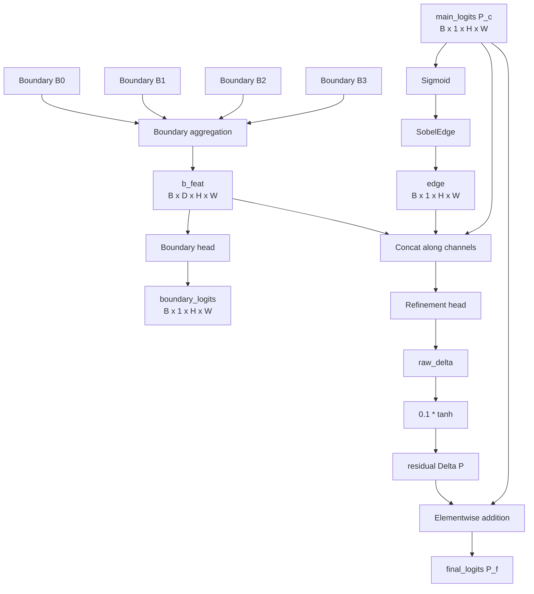

```latex
\begin{aligned}
F_b &= \operatorname{BoundaryAggregate}(\{B^s\}_{s=0}^{3}),\\
P_b &= \operatorname{BoundaryHead}(F_b),\\
E_c &= \operatorname{SobelEdge}(\sigma(P_c)),\\
\Delta_{\mathrm{raw}} &= \operatorname{RefineHead}([F_b;P_c;E_c]),\\
\Delta P &= 0.1\tanh(\Delta_{\mathrm{raw}}),\\
P_f &= P_c + \Delta P.
\end{aligned}
```

### 5.1 Boundary Aggregation Block

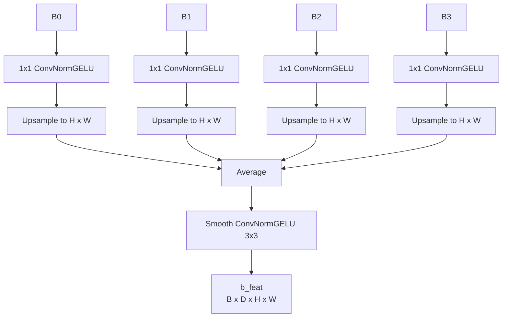

```latex
\begin{aligned}
Q^s &= \operatorname{Up}\left(\operatorname{Proj}_{b,s}^{1\times1}(B^s);H,W\right),\\
F_b &= \operatorname{Smooth}\left(\frac{1}{4}\sum_{s=0}^{3} Q^s\right).
\end{aligned}
```

### 5.2 Sobel Operator in Refinement

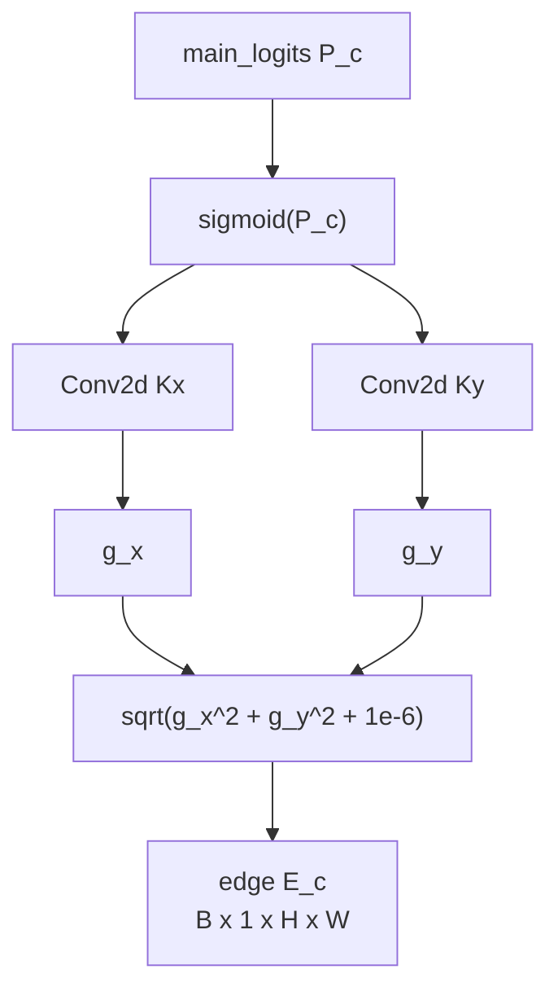

```latex
\begin{aligned}
P &= \sigma(P_c),\\
G_x &= P * K_x,\qquad G_y = P * K_y,\\
E_c &= \sqrt{G_x^2 + G_y^2 + 10^{-6}}.
\end{aligned}
```

### 5.3 Refinement Head

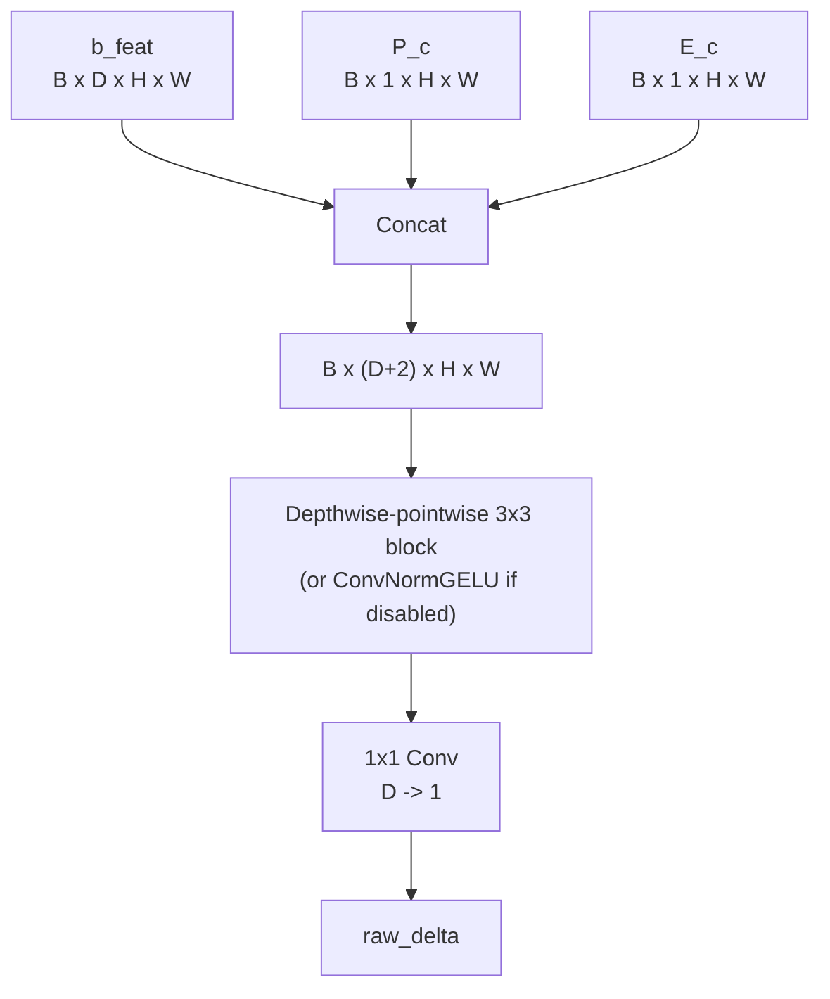

```latex
\begin{aligned}
X_r &= [F_b;P_c;E_c]\in \mathbb{R}^{B\times(D+2)\times H\times W},\\
H_r &= \operatorname{GELU}\left(\operatorname{GN}\left(W_{\mathrm{pw}}^{1\times1} *
      (W_{\mathrm{dw}}^{3\times3} * X_r)\right)\right),\\
\Delta_{\mathrm{raw}} &= W_{\Delta}^{1\times1} * H_r + b_{\Delta}.
\end{aligned}
```

### 5.4 Elementwise Addition Block

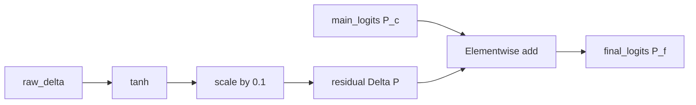

```latex
\begin{aligned}
\Delta P &= 0.1\tanh(\Delta_{\mathrm{raw}}),\\
P_f &= P_c + \Delta P.
\end{aligned}
```

## 6. Shared Helper Blocks in `heads.py`

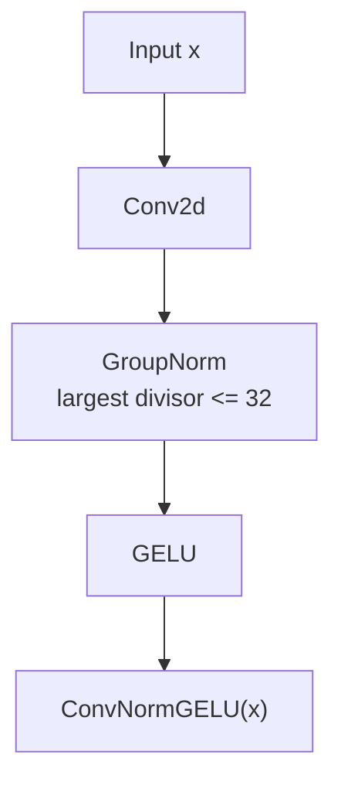

```latex
\begin{aligned}
\operatorname{groups}(C) &= \max\{g: g\le 32,\; C\bmod g=0\},\\
\operatorname{ConvNormGELU}(x) &= \operatorname{GELU}(\operatorname{GN}(W*x)).
\end{aligned}
```

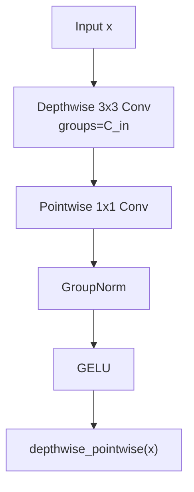

```latex
\begin{aligned}
\operatorname{DWConv}(x)_c &= K_c^{3\times3} * x_c,\\
\operatorname{DepthwisePointwise}(x)
&= \operatorname{GELU}\left(\operatorname{GN}\left(W_{\mathrm{pw}}^{1\times1} *
\operatorname{DWConv}(x)\right)\right).
\end{aligned}
```

## 7. Optional VMamba Adapter in the Same Folder

The active config uses MambaVision, but `src/models/encoders/vmamba_adapter.py` is also in the folder.

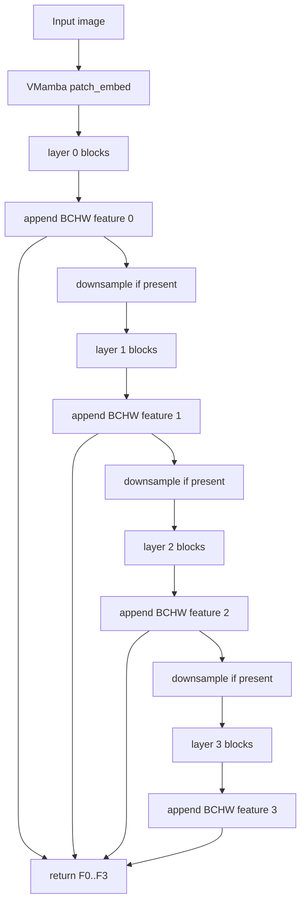

```latex
\begin{aligned}
X_0 &= \operatorname{patch\_embed}(I),\\
X_{s+1},F^s &= \operatorname{VMambaLayer}_s(X_s),\\
\{F^0,F^1,F^2,F^3\} &= \operatorname{VMambaAdapter}(I).
\end{aligned}
```
